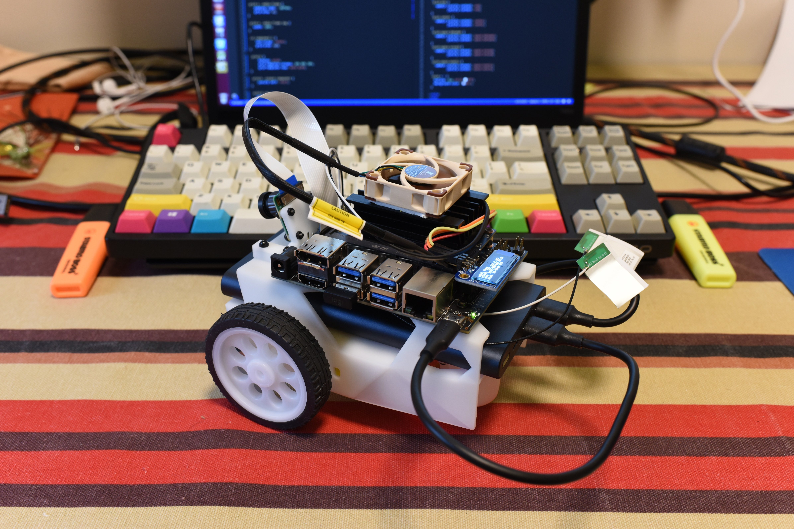
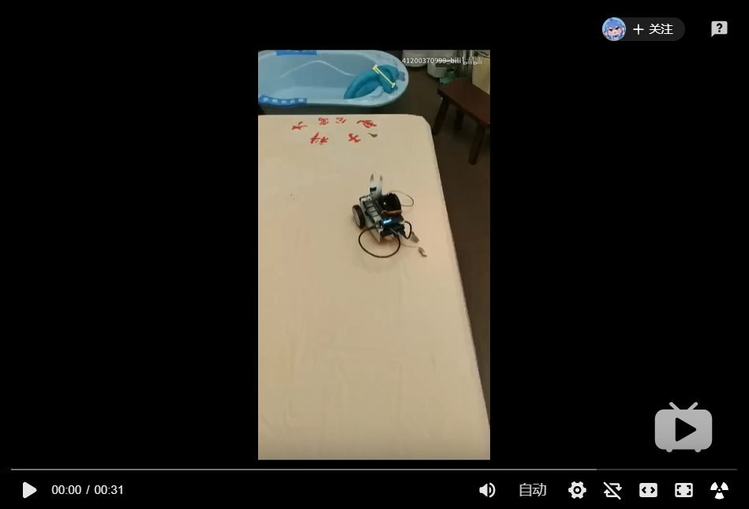

# Building-Jetbot-From-Scratch

这里记录了我从零开始搭建 Jetbot 的整个过程------从零件购买到用手机网页控制 Jetbot 运行。 
[Jetbot 官网网址](https://github.com/NVIDIA-AI-IOT/jetbot)

## 演示
### Collision voidance

### Teleoperation

## 界面

## [Wiki](https://github.com/mayuanjason/mbot/wiki)
* [(Part I): 零件清单](https://github.com/mayuanjason/mbot/wiki/Bill-of-Materials)
* [(Part II): 硬件安装](https://github.com/mayuanjason/mbot/wiki/Hardware-Setup)
* [(Part III): 软件安装](https://github.com/mayuanjason/mbot/wiki/Software-Setup)
* [(Part IV): 网页远程控制](https://github.com/mayuanjason/mbot/wiki/Remote-Control)
